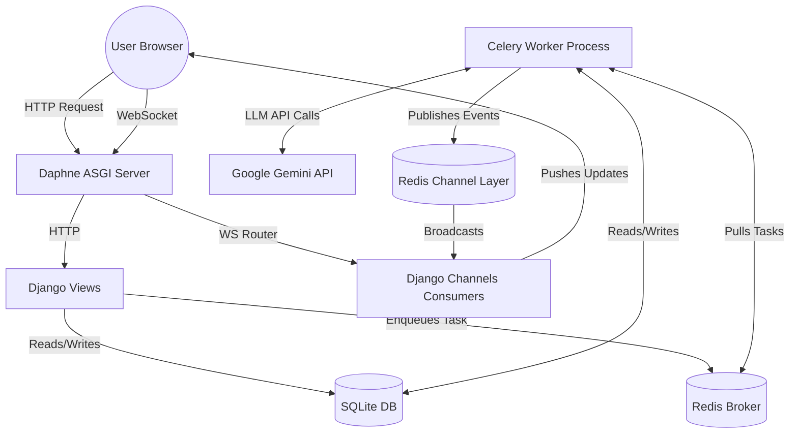

# System Architecture

The Autonomous Content Factory relies on a decoupled, asynchronous architecture. Because Large Language Models (LLMs) like Gemini can take anywhere from 5 to 30 seconds to generate a response, running these calls directly within a standard HTTP request-response cycle would cause browser timeouts and a poor user experience. 

To solve this, we split the application into **User-Facing HTTP Requests** and **Background Processing**.

## High-Level Component Diagram

## The Request Lifecycle

1. **Submission:** The user submits a source document via HTTP POST to `/campaigns/create/`.
2. **Immediate Return:** Django extracts the raw text from the file/URL, creates a `Campaign` record in SQLite, and immediately hands off the heavy lifting by calling `run_campaign_pipeline.delay(campaign.id)`. Django then returns a `302 Redirect` to the user's dashboard.
3. **Background Execution:** A separate Celery Worker process picks up the task ID from Redis and begins orchestrating the AI Agents.
4. **Real-Time Feedback:** As the Celery Worker progressing through Agent 1, 2, and 3, it publishes log messages to a specific Redis Channel Group (e.g., `campaign_42`).
5. **WebSocket Delivery:** The user's browser, sitting on the dashboard page, has an open WebSocket connection to Daphne. The `CampaignDashboardConsumer` listens to that Redis Channel Group and immediately pushes the log payloads down to the browser.
6. **Completion:** Once Agent 3 approves all pieces, the database is marked as `completed`, and the user is allowed to view the final results.

## Infrastructure & Startup (`launch.sh`)

Managing multiple processes (Django, Celery, Redis) during development can be error-prone. We use an idempotent bash script (`launch.sh`) to guarantee a clean startup state.

### How `launch.sh` works:
1. **Environment Check:** It strictly enforces that the `GEMINI_API_KEY` exists (either in the environment or by sourcing a local `.env` file). It fails immediately if missing.
2. **Redis Validation:** It actively pings the local Redis server. If it doesn't respond, it attempts to `redis-server --daemonize yes` as a fallback.
3. **Process Cleanup & Restart:** Instead of just starting processes, it searches for existing ones (`pgrep -f "celery"` and `lsof -Pi :8000`) and brutally terminates them (`kill`) before starting fresh instances via `nohup`. This guarantees no "Address already in use" port conflicts.
